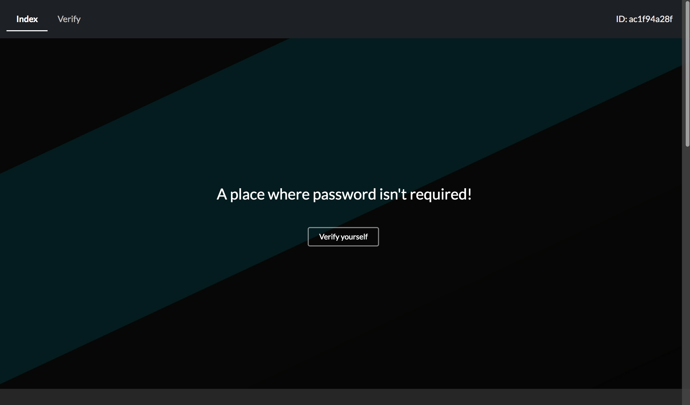
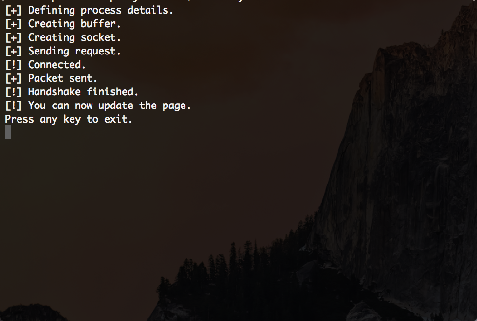
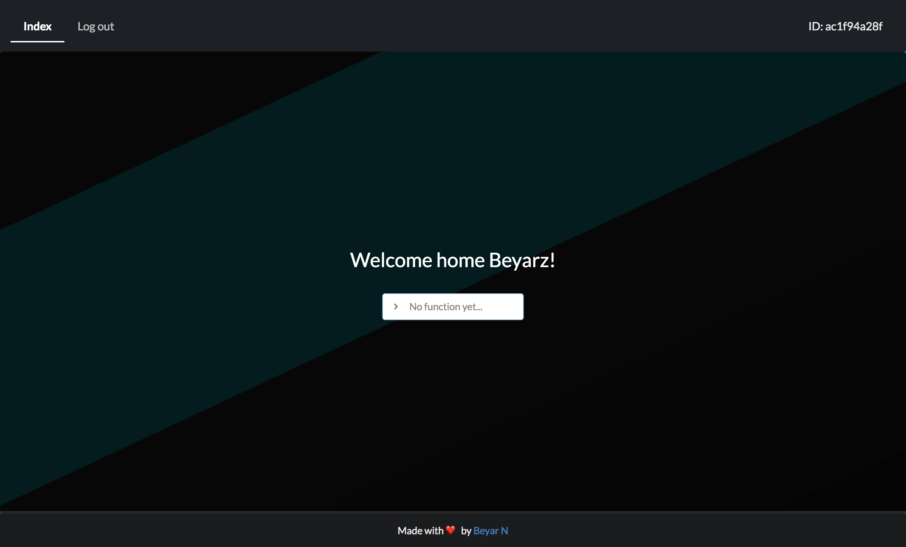

# noPass
noPass, a project by me with the intention to replace the old fashioned way of submitting your username & password in order to verify yourself, the idea with this project was to make it a lot easier for the user to easily verify themselfs (their device technicaly) in order to gain access to a temporary session.

### Upside
The upside with this method is that the user doesn't have to remember any username nor any password, all of that has already been taken care of by the server.

### Purpose
This project is meant to be used for something you would do once or really quick and then leave.
You only have to click on the verify button, run the script and then you would automatically receive a session by the web-server!

### Preview
Here's a couple of images of how the website looks like.

Idk why I did this part, it had no use.

